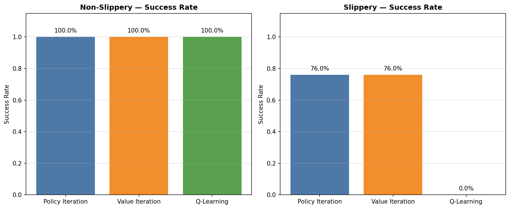
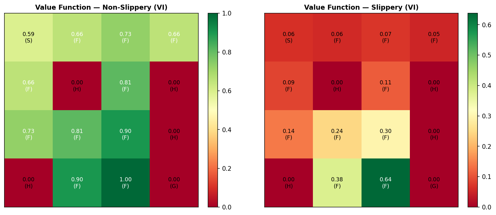
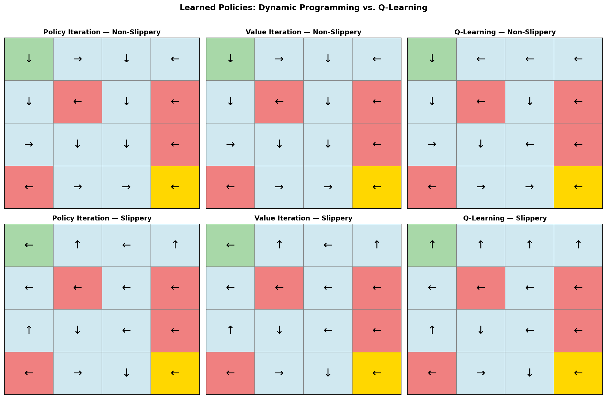
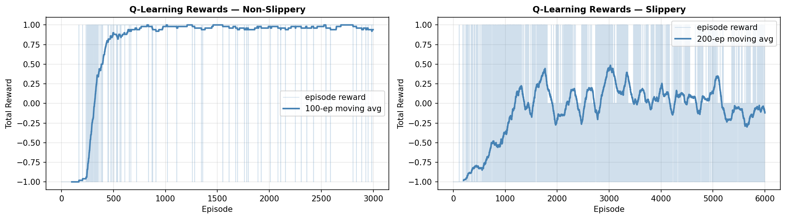
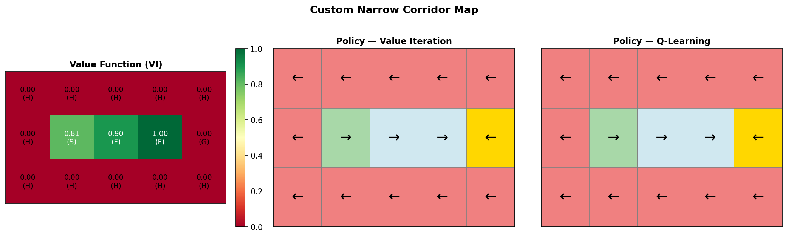

# Frozen Lake: Dynamic Programming and Tabular RL

Classical reinforcement learning methods implemented from scratch with NumPy, benchmarked on the [Frozen Lake](https://gymnasium.farama.org/environments/toy_text/frozen_lake/) environment from Gymnasium.

---

## Algorithms

| Algorithm | Type | Model Required |
|---|---|---|
| Policy Iteration | Dynamic Programming | Yes |
| Value Iteration | Dynamic Programming | Yes |
| Q-Learning (ε-greedy) | Tabular RL | No |

---

## Results

### Success Rate — 4×4 Standard Map

| Algorithm | Non-Slippery | Slippery |
|---|---|---|
| Policy Iteration | **100%** | 76% |
| Value Iteration | **100%** | 76% |
| Q-Learning | **100%** | 0%* |

\* Slippery Q-learning is sensitive to the ε-decay schedule; DP methods use the full transition model.



### Learned Value Functions



### Learned Policies



### Q-Learning Training Curve



### Custom Narrow Corridor (`HHHHH / HSFFG / HHHHH`)



---

## Environment

The standard `FrozenLake-v1` wrapped with a custom −1 penalty for holes (the default gives 0), providing a denser reward signal for model-free methods. Evaluated on:

- **4×4 standard map** — deterministic and stochastic (slippery) variants
- **3×5 narrow corridor** — single viable path, used in the original research poster

---

## Repo Structure

```
notebooks/
  frozen_lake_dp_and_rl.ipynb   # all algorithms + experiments
  minigrid_experiments.ipynb    # exploratory MiniGrid extension
docs/
  frozen_lake_challenge.pdf     # original Student Research Day poster
results/
  figures/                      # plots generated by the notebook
  tables/                       # CSV evaluation tables
requirements.txt
```

---

## Reproduce

```bash
git clone <repo-url>
cd frozen-lake-reinforcement-learning
pip install -r requirements.txt
jupyter notebook notebooks/frozen_lake_dp_and_rl.ipynb
# Kernel → Restart & Run All
```

---

## Background

Extended and cleaned-up version of an undergraduate research project at **Kean University** (Department of Mathematical Sciences), supervised by **Dr. Israel R. Curbelo**.

Originally presented at **Student Research Day** by Qiutong Liu, Weixun Xie, Sihan Fu, Junyang Li, and Zhirui Chen. The original poster is preserved in [docs/frozen_lake_challenge.pdf](docs/frozen_lake_challenge.pdf).
